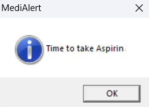

# MediAlert - Smart Medicine Reminder System
## Overview
MediAlert is a powerful console-based application designed to support patients in managing their medications. Acting as a personal medication assistant, it runs seamlessly in the background, continuously tracking schedules and sending real-time reminders through Windows’ native MessageBox API. Patients can easily add, view, and remove medicines, ensuring flexibility and full control over their treatment plans. This guarantees they never miss a dose, promoting better treatment adherence and healthier outcomes.
It is engineered with modern C++ and efficient data structures delivering light and fast performance. 

## Key Features
-  Real-Time Notifications: Seamless Windows API integration (MessageBox) for precise, system-level reminders.
-  Efficient Data Management: Hash-Based Storage for lookup and removal operations in O(1), and a persistent CSV-based storage.
-  OOP-Driven Design: Each medicine is represented as an object with properties like name, time.
-  Performance Optimization: Multi-threaded reminder engine ensures continuous background monitoring.

## Installation
Ensure you have C++ Compiler with C++11 support installed

Steps
1. Clone the repository
```bash
git clone https://github.com/rahmaaref/MediAlert.git
```
2. Compile the project
```bash
g++ -std=c++11 -pthread main.cpp Medicine.cpp -o MediAlert.exe
```
3. Run the application
```bash
./MediAlert.exe
```

## Tech Stack
- C++
- Windows Api

## Implementation
- OOP: Each medicine is represented as an object with properties like name, time.
- Data Structures: unordered_multimap for several strategic reasons:
  - O(1) Average Complexity: Lightning-fast insertions, lookups, and deletions
  - Memory Optimization: Hash-based storage reduces memory fragmentation
- Smart Threading Architecture

## Screenshots
### 1. Add Medicine


### 2. View Medicines


### 3. Remove Medicine


### 4. Alert Notification


## Future Enhancements
- GUI Interface: Migration to Qt for modern UI
## License
This project is licensed under the MIT License
